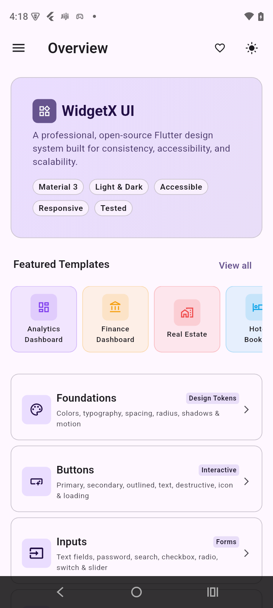
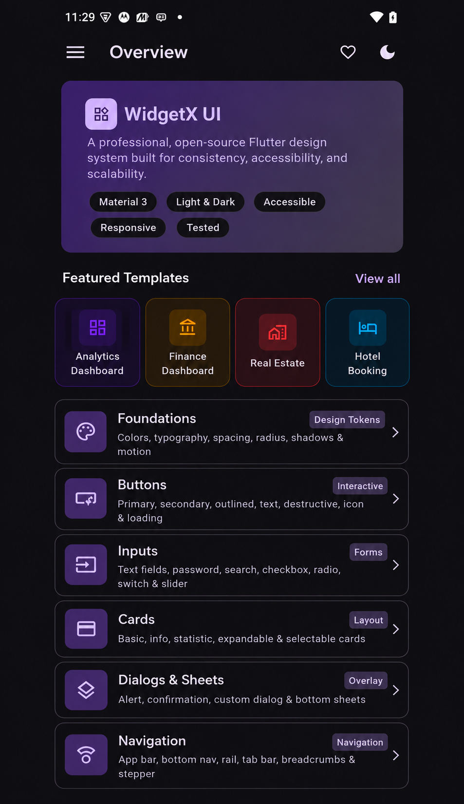
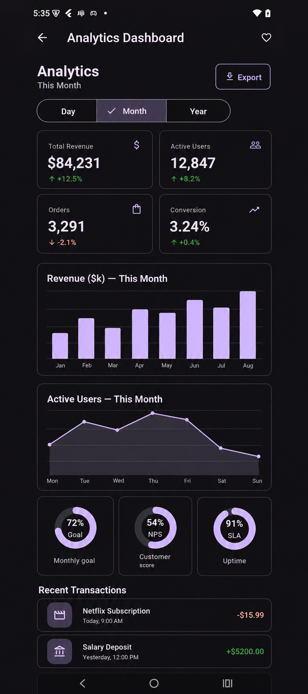
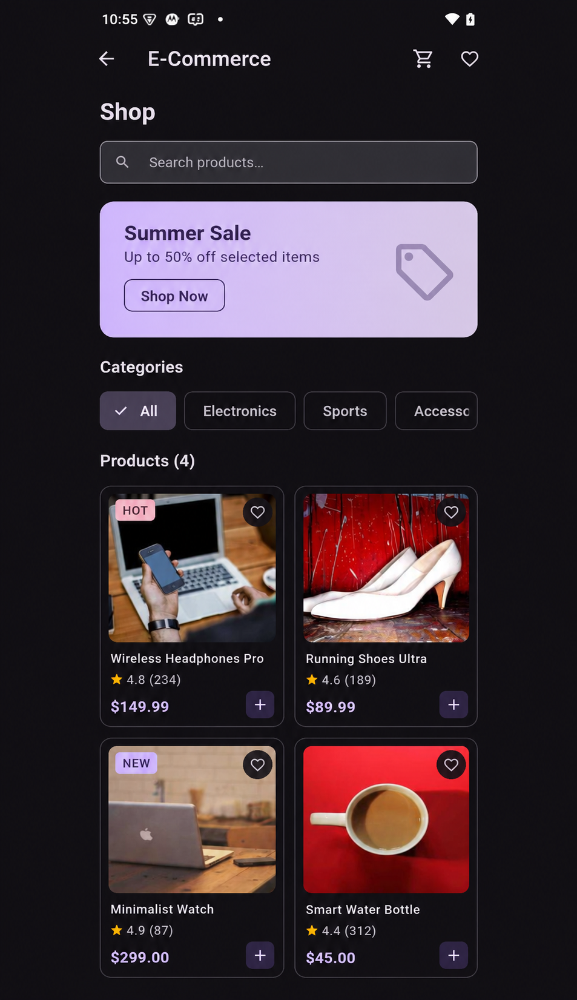
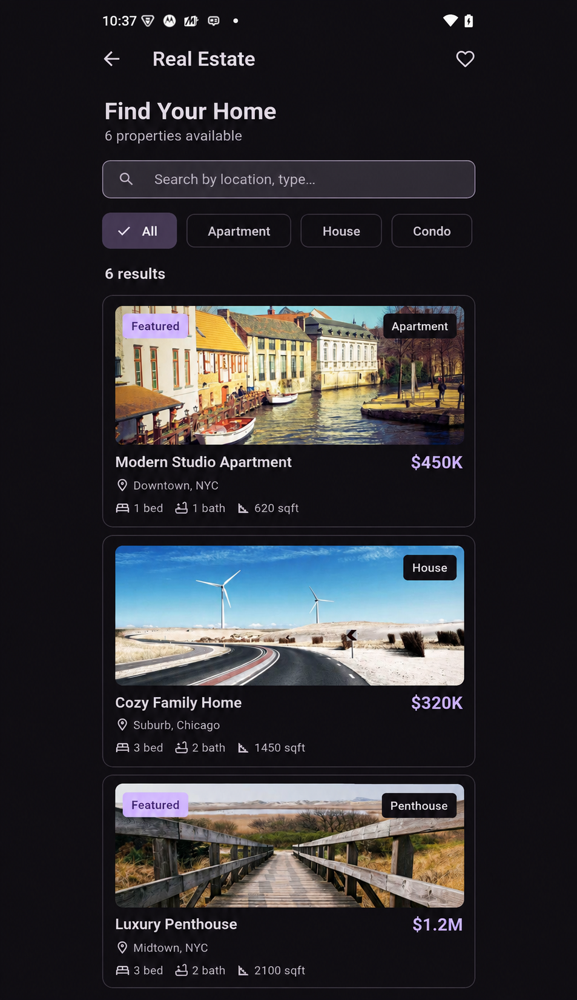
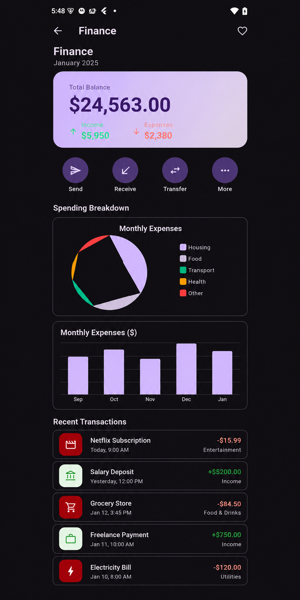

<div align="center">

# WidgetX UI

### A Production-Ready Flutter UI Design System

**Reusable widgets. Complete UI templates. Responsive layouts. Beautiful animations. Production-quality architecture.**

[](https://github.com/nehathakur834/widgetx_ui/actions)
[](https://nehathakur834.github.io/widgetx_ui/)
[](LICENSE)
[](https://flutter.dev)
[](https://m3.material.io)
[](https://riverpod.dev)

[**Live Demo**](https://nehathakur834.github.io/widgetx_ui/) · [**Documentation**](docs/) · [**Contributing**](CONTRIBUTING.md)

</div>

---

## What is WidgetX UI?

WidgetX UI is a complete Flutter UI ecosystem — not just a component library.

It combines a **reusable Flutter package** (`packages/widgetx_ui`) with a **polished interactive app** containing complete, production-quality UI templates built entirely from WidgetX components.

The project demonstrates senior-level Flutter development including:

- Component-driven architecture with a strict design token system
- Material 3 theming with dynamic accent color support
- Responsive layout system for mobile, tablet, desktop, and web
- 15 complete UI templates (Auth, Dashboard, E-Commerce, Finance, Real Estate, Social, Food, Productivity, Portfolio, Settings)
- Riverpod state management with persistence
- go_router navigation
- Accessibility semantics and WCAG compliance
- 97+ automated tests
- GitHub Actions CI/CD with GitHub Pages deployment

---

## Screenshots

> Live demo: [https://nehathakur834.github.io/widgetx_ui/](https://nehathakur834.github.io/widgetx_ui/)

| Light Theme | Dark Theme |
|-------------|------------|
|  |  |

| Dashboard Template | E-Commerce Template |
|--------------------|---------------------|
|  |  |

| Real Estate Template | Finance Template |
|----------------------|-----------------|
|  |  |

---

## Feature Overview

### Design System

| Token Group | Components |
|-------------|------------|
| **Colors** | Primary, Secondary, Tertiary, Surface, Error, Warning, Success, Info, Outline, Disabled, Focus — light & dark |
| **Typography** | Display, Headline, Title, Body, Label, Caption — Material 3 scale |
| **Spacing** | `xxs` (2px) → `xxxl` (64px) — 8 defined constants |
| **Radius** | `xs` (4px) → `full` (9999px) — 7 defined constants |
| **Shadows** | `sm`, `md`, `lg` shadow presets |
| **Motion** | `fast` (100ms) → `emphasis` (500ms) + 4 named curves |
| **Breakpoints** | Mobile 0 · Tablet 600 · Desktop 1024 · Widescreen 1440 |

### Components

| Category | Components |
|----------|-----------|
| **Buttons** | Primary, Secondary, Outlined, Text, Destructive, Icon (4 variants), Loading |
| **Inputs** | TextField, PasswordField, SearchField, Checkbox, Switch, Slider, Radio, Dropdown |
| **Cards** | Basic, Expandable, Selectable, Loading skeleton |
| **Dialogs** | Alert, Confirmation, Custom, Modal Bottom Sheet, Action Sheet |
| **Navigation** | AppBar, BottomNav, NavRail, TabBar, SegmentedControl, Breadcrumbs, Stepper |
| **Data Display** | Badge, OverlayBadge, Chip, Avatar, AvatarGroup, ListTile, KeyValueRow, Divider, Timeline, Accordion, DataTable, EmptyState |
| **Feedback** | Snackbar, Banner (4 variants), CircularProgress, LinearProgress, Skeleton, SkeletonText |
| **Layout** | Responsive, ResponsiveBuilder, ResponsiveContainer, BreakpointConfig |

### UI Templates (15 complete screens)

| Category | Templates |
|----------|----------|
| **Authentication** | Login, Register, Onboarding (3-page) |
| **Dashboard** | Analytics Dashboard (stat cards, bar chart, transactions) |
| **E-Commerce** | Home, Product Details, Cart |
| **Finance** | Finance Dashboard (balance, income/expense, transactions) |
| **Real Estate** | Property Listing, Property Details |
| **Social** | Social Feed (stories, posts, interactions) |
| **Food Delivery** | Restaurant Listing Home |
| **Productivity** | Task Dashboard (projects, tasks, progress) |
| **Portfolio** | Developer Portfolio (hero, skills, timeline, contact) |
| **Settings** | Settings (appearance, notifications, account, about) |

---

## Quick Start

### 1. Clone the repository

```bash
git clone https://github.com/nehathakur834/widgetx_ui.git
cd widgetx_ui
```

### 2. Run the app

```bash
flutter pub get
flutter run -d chrome   # Web
flutter run             # Mobile / desktop
```

### 3. Use the package in your project

```yaml
# pubspec.yaml
dependencies:
  widgetx_ui:
    path: ../packages/widgetx_ui  # local
    # OR after publishing:
    # widgetx_ui: ^0.1.0
```

```dart
import 'package:widgetx_ui/widgetx_ui.dart';

// Configure theme
MaterialApp(
  theme: WidgetXTheme.light(),
  darkTheme: WidgetXTheme.dark(),
  themeMode: ThemeMode.system,
)

// Use components
WidgetXButton(
  label: 'Get started',
  variant: WidgetXButtonVariant.primary,
  size: WidgetXButtonSize.large,
  onPressed: () {},
)

WidgetXCard(
  title: const Text('Order Summary'),
  body: const Text('3 items · \$49.99'),
  onTap: () {},
)

WidgetXBadge(
  label: 'Active',
  variant: WidgetXBadgeVariant.success,
)

WidgetXResponsive(
  mobile: MobileLayout(),
  tablet: TabletLayout(),
  desktop: DesktopLayout(),
)
```

---

## Design Tokens

Never hardcode visual values. Use design tokens throughout:

```dart
// Spacing
WidgetXSpacing.xs   // 4px
WidgetXSpacing.sm   // 8px
WidgetXSpacing.md   // 16px
WidgetXSpacing.lg   // 24px

// Radius
WidgetXRadius.sm    // 8px
WidgetXRadius.md    // 12px  
WidgetXRadius.lg    // 16px
WidgetXRadius.xl    // 24px
WidgetXRadius.full  // pill

// Motion
WidgetXMotion.fast      // 100ms
WidgetXMotion.normal    // 200ms
WidgetXMotion.standard  // Curves.easeInOut

// Colors
WidgetXColors.primary   // #3B82F6
WidgetXColors.success   // #10B981
WidgetXColors.error     // #EF4444
```

---

## Theming

### Basic setup

```dart
MaterialApp(
  theme: WidgetXTheme.light(),
  darkTheme: WidgetXTheme.dark(),
  themeMode: ThemeMode.system,
)
```

### Accent color customization

```dart
// Use a custom seed color (generates full ColorScheme)
MaterialApp(
  theme: WidgetXTheme.light(seedColor: Color(0xFF7C3AED)),
  darkTheme: WidgetXTheme.dark(seedColor: Color(0xFF7C3AED)),
)
```

### ThemeExtension tokens

```dart
final ext = Theme.of(context).extension<WidgetXThemeExtension>()!;
ext.successColor   // semantic success
ext.warningColor   // semantic warning
ext.focusColor     // focus ring color
```

---

## Responsive Layout

```dart
// Switch widget based on screen width
WidgetXResponsive(
  mobile: MobileLayout(),
  tablet: TabletLayout(),
  desktop: DesktopLayout(),
)

// Builder pattern
WidgetXResponsiveBuilder(
  builder: (context, size) {
    return size == WidgetXScreenSize.desktop
        ? DesktopGrid()
        : MobileList();
  },
)

// Constrained container
WidgetXResponsiveContainer(
  tabletMaxWidth: 720,
  desktopMaxWidth: 1080,
  child: content,
)
```

---

## Accessibility

All components include accessibility support out of the box:

```dart
// Semantic labels
WidgetXButton(
  label: 'Continue',
  semanticLabel: 'Continue to checkout',
  onPressed: () {},
)

// Live regions for status messages
WidgetXBanner(
  variant: WidgetXBannerVariant.error,
  message: 'Payment failed.',
  // liveRegion: true — auto-announced by screen readers
)

// Focus management
WidgetXFocusUtils.requestFocusNextFrame(myFocusNode);
```

---

## Architecture

```
widgetx_ui/
│
├── packages/widgetx_ui/          # Standalone reusable package
│   ├── lib/
│   │   ├── widgetx_ui.dart       # Public barrel export
│   │   ├── foundations/          # Design tokens
│   │   ├── themes/               # WidgetXTheme, WidgetXThemeExtension
│   │   ├── buttons/
│   │   ├── inputs/
│   │   ├── cards/
│   │   ├── dialogs/
│   │   ├── navigation/
│   │   ├── data_display/
│   │   ├── feedback/
│   │   ├── layout/
│   │   └── utils/
│   └── test/                     # 97+ widget, unit, theme tests
│
├── lib/                           # Interactive app
│   ├── shell/                     # Responsive sidebar shell (go_router ShellRoute)
│   ├── routing/                   # go_router configuration
│   ├── providers/                 # Riverpod (theme, accent, search, favorites)
│   ├── screens/                   # Component demo screens (11)
│   ├── templates/                 # Complete UI templates (15 screens)
│   │   ├── auth/
│   │   ├── dashboard/
│   │   ├── ecommerce/
│   │   ├── finance/
│   │   ├── realestate/
│   │   ├── social/
│   │   ├── food/
│   │   ├── productivity/
│   │   ├── portfolio/
│   │   └── settings/
│   ├── catalog/                   # Reusable demo helpers (CodeBlock, SectionHeader)
│   └── mock/                      # Local mock data
│
├── docs/                          # Documentation
├── .github/workflows/             # CI (flutter_ci.yml) + Deploy (deploy.yml)
├── README.md
├── CHANGELOG.md
├── CONTRIBUTING.md
├── CODE_OF_CONDUCT.md
└── LICENSE
```

### Core principles

- **Package-first** — `widgetx_ui` package is fully independent; the app imports it
- **Design tokens** — zero hardcoded values in any component
- **Composition** — small, focused widgets with sensible defaults
- **Accessibility first** — semantic labels, live regions, focus management, touch targets
- **No business logic** — components are purely presentational
- **No backend** — all templates use local mock data

---

## State Management

The app uses [Riverpod](https://riverpod.dev) with `SharedPreferences` persistence:

| Provider | Type | Persisted |
|----------|------|-----------|
| `themeModeProvider` | `StateNotifier<ThemeMode>` | ✅ |
| `accentIndexProvider` | `StateNotifier<int>` | ✅ |
| `favoritesProvider` | `StateNotifier<Set<String>>` | ✅ |
| `searchQueryProvider` | `StateProvider<String>` | ❌ |
| `previewDeviceProvider` | `StateProvider<PreviewDevice>` | ❌ |

---

## Navigation

Built with [go_router](https://pub.dev/packages/go_router) using a `ShellRoute` for the persistent sidebar:

```
/                     → Home
/foundations          → Design tokens
/buttons              → Button docs
/inputs               → Input docs
/cards                → Card docs
/navigation           → Navigation docs
/dialogs              → Dialog docs
/feedback             → Feedback docs
/data-display         → Data Display docs
/layout               → Layout docs
/accessibility        → Accessibility docs
/templates/auth/login → Login template
/templates/dashboard  → Analytics Dashboard
/templates/ecommerce  → E-Commerce home
/templates/finance    → Finance Dashboard
/templates/realestate → Real Estate listing
/templates/social     → Social feed
/templates/food       → Food delivery home
/templates/productivity → Task Dashboard
/templates/portfolio  → Developer Portfolio
/templates/settings   → Settings
```

---

## Running Tests

```bash
cd packages/widgetx_ui
flutter test
```

**97 tests** covering:
- Design tokens (spacing, radius, motion, breakpoints, colors)
- Light & dark theme behavior, ThemeExtension
- Buttons (all variants, loading, disabled, semantics)
- Cards (basic, expandable, loading, selectable)
- Inputs (TextField, PasswordField, validation)
- Feedback (Banner, Progress, Skeleton, EmptyState)
- Navigation (AppBar, BottomNav, NavRail, TabBar, Breadcrumbs, SegmentedControl)
- Data Display (Badge, Avatar, Timeline, Accordion, DataTable, ListTile)
- Dialogs (Alert, Confirm, Custom)
- Layout (responsive breakpoints, screen size detection)

---

## Technology Stack

| Technology | Purpose |
|-----------|---------|
| Flutter 3.x | UI framework |
| Dart 3.x | Language |
| Material 3 | Design foundation |
| flutter_riverpod | State management |
| go_router | Navigation |
| shared_preferences | Local persistence |
| flutter_animate | Animations |
| google_fonts | Typography |
| flutter_svg | SVG support |

---

## CI/CD

Two GitHub Actions workflows:

### `flutter_ci.yml` — runs on every push and PR

1. `flutter pub get`
2. `dart format --output=none --set-exit-if-changed .`
3. `flutter analyze`
4. `flutter test`
5. `flutter build web --release`
6. Upload web artifact

### `deploy.yml` — deploys on push to `main`

Builds Flutter Web and deploys to GitHub Pages at:
```
https://nehathakur834.github.io/widgetx_ui/
```

---

## Documentation

| Document | Description |
|----------|-------------|
| [Architecture](docs/architecture.md) | Package structure and design principles |
| [Theming](docs/theming.md) | Theme setup, dark mode, accent colors |
| [Accessibility](docs/accessibility.md) | Semantics, focus, WCAG notes |
| [Contributing](CONTRIBUTING.md) | How to contribute |
| [Changelog](CHANGELOG.md) | Version history |

---

## Roadmap

- [ ] Charts (line, bar, pie, area) using `fl_chart`
- [ ] OTP input field
- [ ] Date picker with calendar
- [ ] flutter_animate entry animations on all template screens
- [ ] Golden tests for stable components
- [ ] Booking template (hotel, dates, guests)
- [ ] pub.dev package publication
- [ ] Melos monorepo tooling
- [ ] Component search
- [ ] Device preview frame wrapper

---

## License

MIT — see [LICENSE](LICENSE).

---

## Author

**YOUR NAME**  
GitHub: [@nehathakur834](https://github.com/nehathakur834)  
LinkedIn: [Neha Thakur](https://www.linkedin.com/in/neha-thakur-534749110)  
Portfolio: [YOUR_PORTFOLIO_URL](https://YOUR_PORTFOLIO_URL)

---

<div align="center">

Built with ❤️ using Flutter & Material 3

</div>
